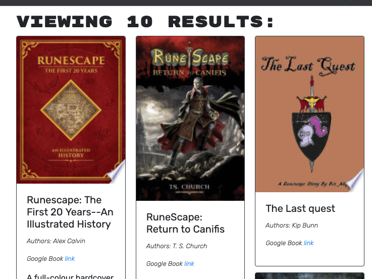

# 21 MERN: Book Search Engine

## Section 01: General Information

21st code Boot Camp assignment.

`Book Search Engine`

by Cristobal Hernandez

Published URL: https://radiant-wave-00242.herokuapp.com/

# Section 02: General Information

Create an application that when runned, `npm install` => `yarn install` inside of `server folder` and `npm start` inside of the client folder. 

This week's assignment is with starting code with the front end(REACT). This code is connected to a fully functioning Google Books API built with a RESTful APIand refactor it to be a GraphQL API built with Apollo Server.The app was built using the MERN stack with a React front end, MongoDB database, and Node.js/Express.js server and API.

# 04 Media

<h3>Media first show</h3>

<h3>Looking at books to save after login/sign up</h3>

<h3>Looking at books saved to the user</h3>

